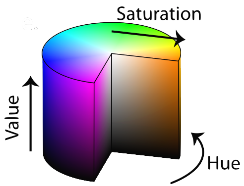
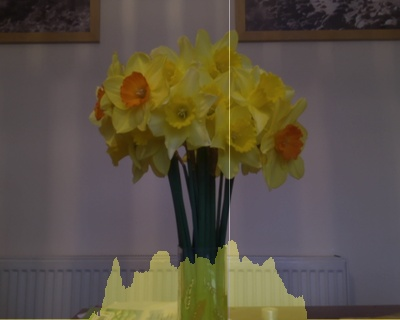
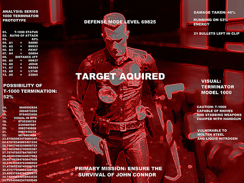
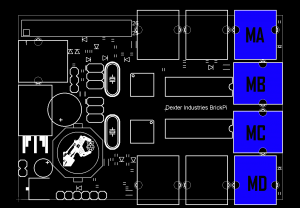
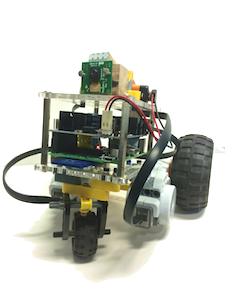

# ObjectTracking

<h1>Object Tracking BrickPi Robot</h1> 
This page is about a project to create an intelligent Raspberry Pi powered mobile robot. The goal is to have a robot that can teach itself to track and chase objects. There are three phases: Object Tracking, Motor Control and Machine Learning. The first two are complete and the robot can track an object of a given colour and chase it. However it does not teach itself to do this. Over the summer one of my students will be creating an <a href="http://en.wikipedia.org/wiki/Artificial_neural_network">Artificial Neural Network</a> for the machine learning part of the project. 

<h1>Phase 1: Object detection</h1>

There are two version of the files: one for use on a Raspberry Pi with camera module, and the other for use on a PC with webcam. There are few changes, but in order to keep the code clean and clear I have made separate versions. 

First you need to make sure that your Raspberry Pi is properly set up and can obtain an image programmatically. My preferred option is to use v4l2. You will also need to install the open Computer Vision library <a href="http://docs.opencv.org">openCV</a>, with 'sudo apt-get install libopencv-dev python-opencv'.

<h2>1. Getting an image</h2>

Once you have those elements installed you can obtain an openCV image object with the python program <a href="https://github.com/MagnusBordewich/ObjectTracking/blob/master/RaspberryPi/1-capture_image.py">1-capture_image.py</a>. Open it in IDLE, and select Run>Run Module from the menu bar. You should see an image from the camera appear on screen. The press a key to see a transformed image.
 

 Once you have that working try the following:

<ul>
<li>Reorienting the image if it is upside down: find the function cv2.flip(image,-1). The number in the brackets controls what sort of flip is done. Try changing it to 0 or 1, to get a correct orientation for your image, then try other numbers to see the effect.</li>
<li>Obtaining images of different sizes: change the values of variables w and h in the lines "w=480" and "h=320".</li>
<li>Adjust the blur, and try other <a href="http://docs.opencv.org/modules/imgproc/doc/filtering.html">image filtering</a> options.</li>
</ul>

<h2>2. Identify a region by hue</h2>

Computers normally store an image as a giant matrix with three values for each pixel: the intensity if red, green and blue (RGB values) that combine to make the colour of the pixel. A simple but fairly robust method of indetifying an object is by colour. However you want to specify the colour in a way that isn't too much affected by how light or dark the lighting on the object is, or how washed out or exposed the image is. This is tricky when specifying ranges of RGB values, but can be done by looking at the hue of the object.

            
        

 This is done in the program <a href="https://github.com/MagnusBordewich/ObjectTracking/blob/master/RaspberryPi/2-detect_hue.py">2-detect_hue.py</a>, again press a key to step through the images. The function cv2.cvtColor(image,cv2.COLOR_BGR2HSV) converts the representation from three RGB values for each pixel, to a Hue, Saturation and Value value for each pixel. Hue give the essential colour, Saturation gives the intensity of that colour and Value gives the overall brightness of the pixel, as depicted in this image.

 By specifying a tight range of hue values, and a very wide range of saturation and value values, we should identify all regions that contain objects of a given colour, regardless of lighting conditions. The print statement in the program will output the HSV values of the centre pixel of the image to the console.

 The variables lower_pink and upper_pink in the program are used to specify Hue between 160 and 175, which is roughly the pink of pink post-it notes, and saturation and value values between 50 and 255, i.e. weak and dark up to strong and bright pink.

 The function cv2.inRange is used to create a mask - a matrix of 0s and 255s with 255s where the corresponding pixel was sufficiently pink, and a 0 elsewhere. I also create an opposite mask (mask_inverted), by swapping 0s and 255s. 0 and 255 are used, because when interpreted as a greyscale image, this gives a black and white mask. The masks are used to make two images - one where I convert the original image to greyscale, then do a bitwise-and with the inverted mask to keep only pixels that were not pink, and the other from a bitwise-and of the original image and the mask to keep only the pink pixels. Combining these gives an image where pink parts are kept but everything else is greyscale. 

 Once you have this working try the following:

<ul>
<li>The lines "cv2.imshow('View',xxx)" and "cv2.waitKey(0)" show the image 'xxx' and wait for a key press before continuing. Try putting in extra copies of these lines at different points, changing xxx to mask, mask_inverted or image_masked, to see steps of the process.</li>
<li>Adjusting the HSV values in lower_pink and upper_pink to target a completely different colour.</li>
<li>If you can't work out the HSV values of something you wish to target, then use the program <a href="https://github.com/MagnusBordewich/ObjectTracking/blob/master/RaspberryPi/HSV_finder.py">HSV_finder.py</a> which will show live the HSV value in the centre of the image.</li>
</ul>

<h2>3. Target the direction with the greatest match for your hue</h2>

The next step, program <a href="https://github.com/MagnusBordewich/ObjectTracking/blob/master/RaspberryPi/3-add_line.py">3-add_line.py</a>, involves a basic operation on the matrix values and a loop. First we take the mask, which is a matrix of 255s and 0s, where 255s represent pixels that are pink. We want the total number of pink pixels in each vertical line of the image. 

We can get this from the function np.sum(mask,axis=0). (Note: np. means use a <a href="http://www.numpy.org">NumPy</a> operation, which is a useful library of mathemtical functions in Python.) np.sum(mask,axis=0) means take the matrix 'mask' and sum each column, so LRarray = np.sum(mask,axis=0)/255 means we set LRarray to be a list of numbers, one for each column, where each value is the sum of the column values divided by 255 - i.e. the number of pink pixels in that vertical line.

 The loop starts with 'for i in range(w):'. This means 'for each value of i in the range 0 up to to w-1 do whatever is in the indented lines below'. Computers always count from 0, so we cover each of the w columns by counting from 0 to w-1. Python programs use indentation to define loops and other blocks of code - so getting the indentation right is important.

 In the loop, for each i, we look at the ith entry in our list of numbers LRarray (denoted LRaray[i]) and ask if it is the biggest we have seen yet. The biggest value seen yet is called max_x_intensity; if LRarray[i] is bigger than this, then we remember this value of i (by setting max_x_coordinate to i), and reset max_x_intensity to the new biggest, otherwise we skip those two lines.

 The result of the loop is that we know what value of i corresponds to the column with the largest number of pink pixels, and we have remembered it as max_x_coordinate. We then draw a line on the image from the top of this column to the bottom.

 Once you are happy with this, try the following:

            
        

<ul>
<li>Change the axis of the np.sum to 1, so that you sum over rows instead of columns. You will have to loop over a range h, instead of w, since there are h rows in the image. Then change the line drawn to be horizontal through the most pink row by changing the coordinates in the cv2.line function. </li>
<li>Or add both horizontal and vertical lines and see if you pick out the middle of the pink object.</li>
<li>Rather than adding only a line at the most pink point, try adding a line at the bottom of every column with height proportional to the number of pink pixels in that column (i.e. a histogram, done here for isolating yellow).</li>
<li>Consider how you might use this type of information to identify objects, or work out the size of pink objects.</li>
</ul>

<h2>4. Do it for real-time video</h2>
Now that we have loops, it is an easy step to do everything for live video, as is done in program <a href="https://github.com/MagnusBordewich/ObjectTracking/blob/master/RaspberryPi/4-video.py">4-video.py</a>. We simple add a huge loop around the code, and remove any wait-for-key-presses or showing of non-finished images. Note that we have had to indent all the previous code, so that it is in the block that will be looped over.

Here I used a 'while(True):' loop. This loop will just keep on looping until we break it. I have replaced the function cv2.waitKey(0), which means wait here forever for a key press, with 'key_pressed = cv2.waitKey(1)' which means only wait 1 millisecond, but if a key is pressed, remember which one in the variable key_pressed. We can then check if the Esc key was pressed (key 27) and if so break (exit the loop), if not just keep looping.

<ul>
<li>Try putting a loop around your code from (2) or (3) to show the hue isolation live.</li>
</ul>
<h2>5. Move from direction with greatest hue, to identifying objects</h2>

 The approach we have so far could be confused between a large number of small pink objects one above the other and a single large pink object. Really we want to identify a single large object, and openCV has a convenient way to do this. In order to save ourselves a fair amount of effort, let's use openCV functions from here. We can use a function to find '<a href="http://opencvpython.blogspot.co.uk/2012/06/hi-this-article-is-tutorial-which-try.html">contours</a>' which are outlines of a region of a single colour. The contours themselves are lists of points (given by x and y coordinates) which surround a region of pink in a join-the-dots style.  A second function then draws the contours.

<ul>
<li>The sample code is <a href="https://github.com/MagnusBordewich/ObjectTracking/blob/master/RaspberryPi/5-contours.py">5-contours.py</a>.</li>
<li>Work out what the variable 'contours' is for a simple shape. Contours is a list of outlines, each of which is a list of coordinates, each of which is a list containing an x and a y coordinate - so contours is a list of lists of lists.</li>
<li>Consider the mathematical optimisation problem of defining a reasonable outline for a complex shape using a list of coordinates. You don't want to list every single point on the boundary - there could be thousands. You want the  straight lines between points to closely match the actual boundary, up to some allowable error. Determining which points to pick, and doing it efficiently, is the sort of mathematical task that crops up throughout computing.</li>
</ul>

<h2>6. Target the largest matching object</h2>
Now we have almost got what we want. Once we have the list of contours, we can look through it looking for the biggest contour by area. For fun, rather than just outlining the area, let's draw a target over it, and make the target size dependent on the size of the object we found. This is done in <a href="https://github.com/MagnusBordewich/ObjectTracking/blob/master/RaspberryPi/6-target.py">6-target.py</a>.
<ul>
<li>Try to get targets on the two or three largest objects identified.</li>
<li>Only accept targets that are at least a certain size.</li>
<li>Overlay information about the target on the image, e.g. size, hue, coordinates, using the line      &nbsp;&nbsp;&nbsp;&nbsp;&nbsp;&nbsp;&nbsp;&nbsp;cv2.putText(image,"My text",(x,y),cv2.FONT_HERSHEY_PLAIN,1,[255,255,255])
 which will put white text at coordinate (x,y) (but note that y is measured from the top down - i.e. (0,0) is the top-left of the image).
<li>Perhaps include some computed information, e.g. range, calucated from knowledge of the true size of the object and the apparent size in the image.
</ul>

<h2>7. Final example</h2>
This example is from one of our Image Processing courses, and uses a slightly more advanced approach to track the target through time (Kalman Filters, <a href="http://www.bzarg.com/p/how-a-kalman-filter-works-in-pictures/">here</a> is an attempt to explain them simply!), but is still based on hue selection.
<li>Choose a target by dragging the mouse over a region: <a href="https://raw.githubusercontent.com/tobybreckon/python-examples-cv/master/kalman_tracking_live.py">example code</a>.</li> 

This additional example (only accessible from inside our network), is part of a phd a project and is currently gatherring data for further analysis. The video feed shows a thermal imaging camera pointing at our car park. Any vehicles or people that move across the scene should be detected and categorised using a machine learning, not only into type (Car, Van, Person etc.) but also by activity (Walking, Running, Digging, etc.).
<li><a href="http://durham-asm-delta.clients.dur.ac.uk:8080/">Thermal imaging feed</a>.</li>

<h2>Extensions</h2>
There are many directions in which you could take this further. I have used the information from the processed image to get a mobile robot to follow an object (details will appear below), but you could also:

            
        

<ul>
<li>Choose a target by dragging the mouse over a region: <a href="https://raw.githubusercontent.com/tobybreckon/python-examples-cv/master/kalman_tracking_live.py">example code</a> for this from one of our Image Processing courses.
<li>Identify by shape rather than colour, e.g. recognise <a href="http://trevorappleton.blogspot.co.uk/2013/11/python-getting-started-with-opencv.html">circles</a>, <a href="http://opencvpython.blogspot.co.uk/2012/06/contours-2-brotherhood.html">partially obscured shapes</a> or <a href="http://docs.opencv.org/trunk/doc/py_tutorials/py_objdetect/py_face_detection/py_face_detection.html">faces</a>.
<ul><li>Create a <a href="http://thinkrpi.wordpress.com/magic-mirror/">magic mirror</a> that recognises who is sitting in front of it.</li>

<li>Create a Terminator style augmented reality app.</li>
</ul></li>
<li>Explore other abilities of openCV through their <a href-"http://opencv-python-tutroals.readthedocs.org/en/latest/py_tutorials/py_tutorials.html">excellent tutorials</a>.</li>
<li>Add special effects to your home movies. You will need to first open a movie file (cv2.VideoCapture.open(filename)), rather than catpuring video, and then apply an effect such as in step 2 above to each frame.</li>
<li>Use the networking capabilities of the Raspberry Pi: 
<ul>
<li>Stream the images to a website with <a href="https://github.com/jacksonliam/mjpg-streamer">mjpeg streamer</a>. My own instructions on this will appear somewhere here soonish.</li>
<li>Upload images to <a href="https://github.com/andreafabrizi/Dropbox-Uploader">Dropbox</a>.</li>
<li>Control the target with a <a href="RemoteControl.html">smartphone gyroscope</a>. Again further instruction to follow.</li>
</ul></li>
</ul>

<h1>Phase 2: Controlling the robot</h1>
In the video below the robot is first being controlled by the iPhone gyroscopes, then it is tracking targets of varying colours and trying to chase them.

The robot I created uses the <a href="http://www.dexterindustries.com/BrickPi/">BrickPi</a> system for connecting to Lego Mindstorms motors. You will need to follow <a href="http://www.dexterindustries.com/BrickPi/getting-started/">their instructions</a> in order to install the necessary drivers - I took the easy option of using their Raspian image and then installing everything else I wanted, but you can modify an existing system.  

            

            

The first step is to gain control of the motors. The Lego motors attach with a simple cable to one of the ports on the BrickPi board - make sure you know which ports you have used (see image to the right)! You can then run a simple test program to check the basic set up works. There is one in the BrickPi folder Sensor_Examples installed with the drivers (<a href="examples/LEGO-Motor_Test.py">LEGO-Motor_Test.py</a>). Note that the motor speeds must be set between -255 and 255, but low speeds (less than 100) may give poor results - i.e. not rotate under any load. Also the command 'BrickPi.MotorSpeed[PORT_A] = 200' sets the value desired for the motor speed, but does not actuallyt make the motor run. Instead you must use the command 'BrickPiUpdateValues()' to actually push the values to the motors, moreover you must push the values to the motors very frequenly, every 1/10 of a second, or the motors stop! Look at the example code to see how the command is repeated so often.

Unfortunately this is not a convenient thing to do when you want to be doing something else with your code. One solution is to set up a <a href="http://en.wikipedia.org/wiki/Thread_(computing)">thread</a> to repeat this command all the time. A thread is like a mini-program within your program that keeps on running on its own even when your main code has gone on to do other things. The next example <a href="examples/Threaded_Motor_Test.py">Threaded_Motor_Test.py</a> includes some code at the beginning to launch a thread whose only purpose is to repeat the BrickPiUpdateValue() command every 1/10 second - once it is set up the rest of the code continues as normal. 

 Once the motors are working you will have to build some sort of vehicle. I based mine on the classic <a href="http://www.nxtprograms.com/castor_bot/steps.html">Lego caster-bot</a>, and BrickPi have a similar design called the <a href="http://www.dexterindustries.com/BrickPi/projects/simplebot/">Simplebot</a>. This means I have a left and right motor, and by varying the speeds the bot can turn either as it moves forward or on the spot. You can run the motors with only a standard powersource plugged in to the Raspberry Pi - this is how I use it for testing as long as the bot does not need to travel far! However to have independence from wires you need to use batteries to power the Raspberry Pi and BrickPi. I have found that a pack of 8 rechargable AA batteries (or 6 non-rechargable) plugged in to the BrickPi board gives enough power to drive the motors and power the Raspberry Pi board for quite a while. However <a href="http://www.dexterindustries.com/BrickPi/getting-started/power-up-the-brickpi/">other options are available</a>. 
<ul>
<li>When your bot is complete, try giving it a fixed programme of movements to follow some path, e.g. 100cm forward, turn left, move 50cm forward, turn right etc. You will need to time how long it take to travel a given distance and step appropriate motor speeds. </li></ul>

However we do not want the bot to follow a fixed program. instead we want it to interpret what it sees, and behave accordingly. So make sure you have included the camera module in your bot and it is mounted to look forward. Next take the video analysis loop from step 6 above and add it to the main loop of the Threaded_Motor_Test, then set the motor speeds appropriately each time a video frame is analysed, i.e. to turn left when the target is on the left of the screen, and right when it on the right. The code <a href="examples/Pibot_Template.py">Pibot_Template.py</a> gives a basic template, but there is much more that could be done:
<ul>
<li>Add more complex motor control so that the rate of turn depends on how far off-centre the target is, the robot moves forward, rather than just turning on the spot, and stops when the target is sufficiently close.</li>
<li>Remember where the target was last seen, so that if it moves off one side of the camera view, the robot can keep turning in that direction to try and find it again.</li>
<li>Get the robot to track faces, rather than pink objects, and chase people!</li>
</ul>
Note: once you get into chasing objects, you need quick reactions. You will need to look through your code and make sure you are not doing anything unecessary in the main loop, and that the image size (w,h) is as small as possible (so that image anlysis is quick) but still large enough that objects can be reliably detected. 

            

